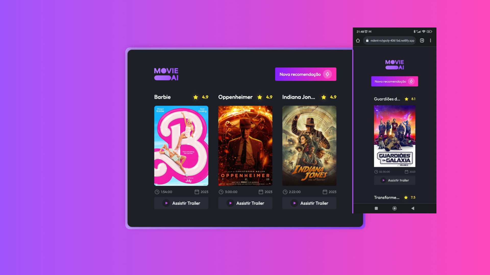

<strong><h1 align="center">#boraCodar - Desafio 30</h1></strong>

  

## 💻 Projeto

Projeto desenvolvido durante o boraCodar 30, evento de desafios de código da [**Rocketseat**](https://www.rocketseat.com.br/). O desafio era desenvolver um gerador de sugestão de filmes. O site utliza como base a API do [TMDB (The Movies Database)](https://www.themoviedb.org/?language=pt-BR).

Você pode visualizar o projeto no ar através [desse link](https://resplendent-rolypoly-4061bd.netlify.app/).
## 🔖 Layout

Você pode visualizar o layout do projeto através [desse link](https://www.figma.com/community/file/1266028958590001589). É necessário ter conta no [Figma](https://figma.com) para acessá-lo.

## 🚀 Tecnologias

Esse projeto foi desenvolvido com as seguintes tecnologias:

- HTML
- CSS
- JavaScript

---

Feito com ♥ by [renansilva15](https://github.com/renansilva15)
